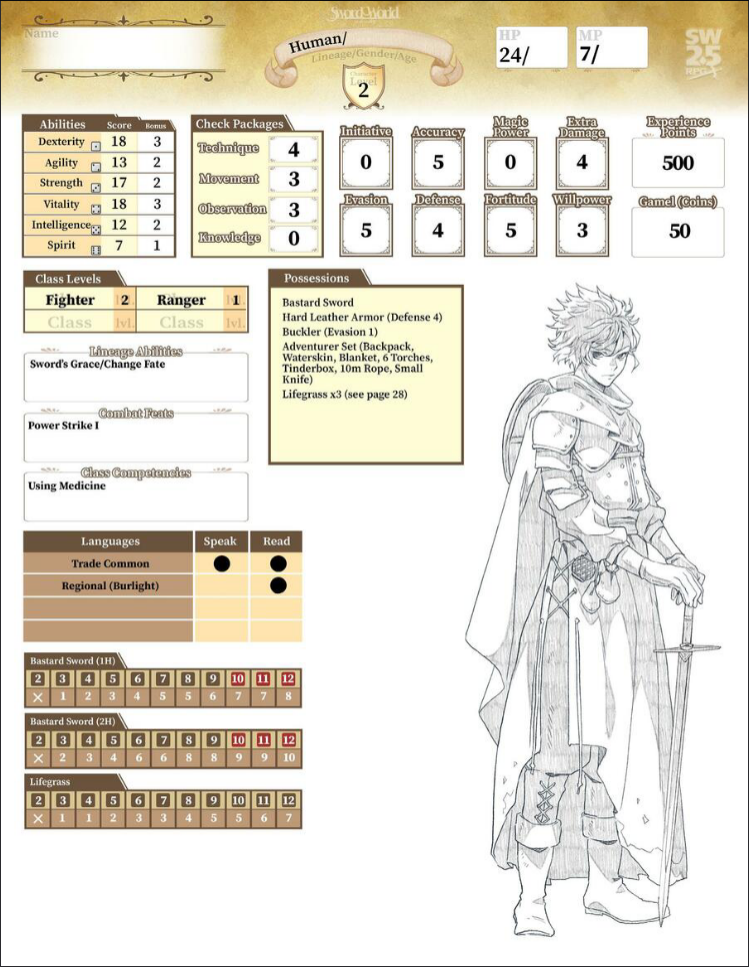
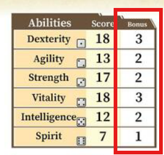
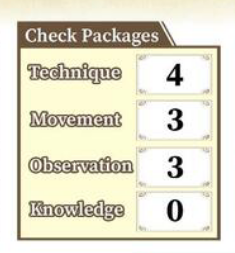
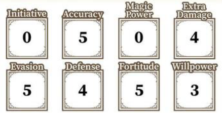

<!-- Sword World 2.5 - Comprendiendo tu hoja de personaje -->

# Comprendiendo tu personaje
Lo primero es entender las hojas de los **personajes jugables** (Abreviando **[PJ](../../dictionary/pj.md)**). Para ello, observemos [la hoja de personaje del guerrero humano](character/sheet/warrior.png).

### Linage, género y edad

Si observas la hoja de personaje, podrás observar que es de linage humano. Su genero y edad están sin definir. Su nivel actual es el 2.

### Clases

Principalmente es guerrero, con 2 niveles en dicha clase, lo cual lo hace un potente combatiente de primera línea. También tiene 1 nivel como cazador, lo que le aporta habilidades de búsqueda y rastreo, de percepción de su ambiente, e incluso cierta capacidad para andar a escondidas.

### Habilidades
Se pueden comprender las características del [PJ](../../dictionary/pj.md) observando los puntos de talento en su hoja.

Sus principales talentos son la [destreza](), indicando que es ágil con sus manos y diestro con las armas, y la [vitalidad](), indicando que a su vez es resistente; ambas tienen 18 puntos. Sus 17 puntos en [fuerza]() también es una puntuación excelente, mostrando que puede manejar poderosas armas y armaduras pesadas.
Su [agilidad]() de 13 y su [inteligencia]() de 12 están ligeramente sobre la media (la media humana está entre los 10 y 11 puntos). Estos talentos le ayudarán a sentir el peligro y evadir ataques enemigos. Solo su [espíritu]() está por debajo de la media, lo que indica que es débil contra la magia. Si es posible, este personaje devería evitar pelear sin la ayuda de compañeros contra magos sobre los que no tenga una ventaja abrumadora.

### Valores estándar
Cuando se trata de jugar el juego, también te encontrarás valores estándar para muchos rasgos importantes en su ficha de personaje. Algunos valores estándar son:
#### Bonos de puntuación de habilidad

Cuanto mayor sea la puntuación de una habilidad, mayor será su bonus. Los bonus de puntuación de habilidad son valores estándar que afectan a actividades como saltar, escalar y sentir las emociones de otros.

#### Paquetes de verificación

Piensa en los paquetes de verificación como el conjunto de habilidades fundamentales. Incluyen [técnica](), [movimiento](), [observación]() y [conocimiento](). Los valores estándar en estas cuatro áreas jugarán un papel importante en su éxito como aventurero. Su valor estándar más fuerte para los paquetes de verificación es [técnica](), con un valor de 4.

#### Rasgos de combate

Los aventureros a menudo se enfrentan peligrosas amenazas ya sea en combate con armas, puños, garras o hechizos. Los valores estándar para rasgos de combate como [Iniciativa](), [Precisión](), [Defensa](), [Fuerza de voluntad]() y [Daño extra]() afectan a cuán efectivos son sus ataques, así como lo bien que evade o resiste el daño infligido por sus enemigos. Como guerrero, tiene buena [Precisión](), [Evasión]() y [Bravura](); el valor estándar para los tres es de 5. Por otro lado no tiene nada de [Potencia mágica](), ya que es un rasgo de combate principalmente utilizado por clases mágicas y sin mucha utilidad para un guerrero clásico.

## Siguientes pasos
* [Lanzando los dados](dies.md)
* [Creando tu personaje](../creation.md)