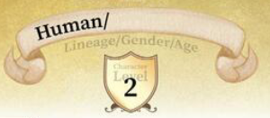
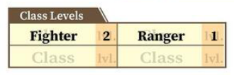
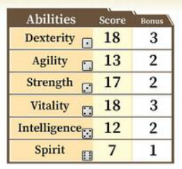

<!-- Sword World 2.5 - Comprendiendo tu hoja de personaje -->

# Comprendiendo tu personaje
Lo primero es entender las hojas de los **personajes jugables** (Abreviando **PJ**). Para ello, observemos [la hoja de personaje del guerrero humano](character/sheet/warrior.png).

### Linage, género y edad

Si observas la hoja de personaje, podrás observar que es de linage humano. Su genero y edad están sin definir. Su nivel actual es el 2.

### Clases

Principalmente es guerrero, con 2 niveles en dicha clase, lo cual lo hace un potente combatiente de primera línea. También tiene 1 nivel como cazador, lo que le aporta habilidades de búsqueda y rastreo, de percepción de su ambiente, e incluso cierta capacidad para andar a escondidas.

### Habilidades
Se pueden comprender las características del [PJ](#comprendiendo-tu-personaje) observando los puntos de talento en su hoja.

Sus principales talentos son la [destreza](), indicando que es ágil con sus manos y diestro con las armas, y la [vitalidad](), indicando que a su vez es resistente; ambas tienen 18 puntos. Sus 17 puntos en [fuerza]() también es una puntuación excelente, mostrando que puede manejar poderosas armas y armaduras pesadas.
Su [agilidad]() de 13 y su [inteligencia]() de 12 están ligeramente sobre la media (la media humana está entre los 10 y 11 puntos). Estos talentos le ayudarán a sentir el peligro y evadir ataques enemigos. Solo su [espíritu]() está por debajo de la media, lo que indica que es débil contra la magia. Si es posible, este personaje devería evitar pelear sin la ayuda de compañeros contra magos sobre los que no tenga una ventaja abrumadora.

### Valores estándar
(pag. 7)

## Siguientes pasos
* [undefined]()